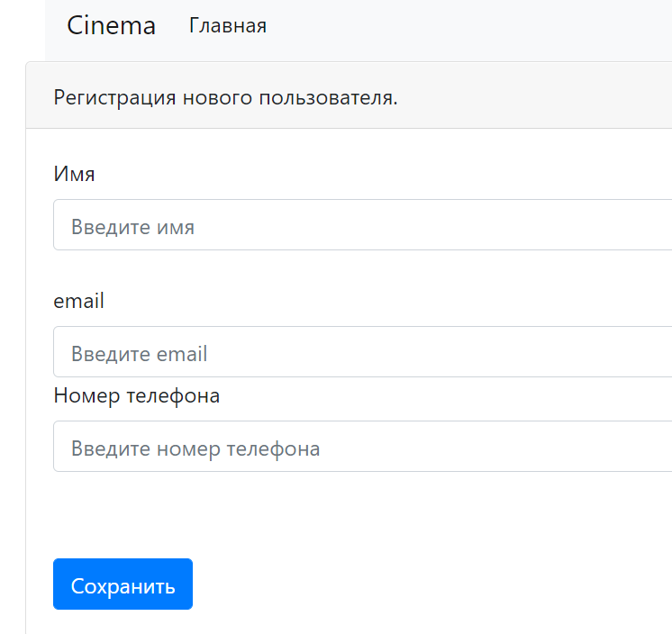
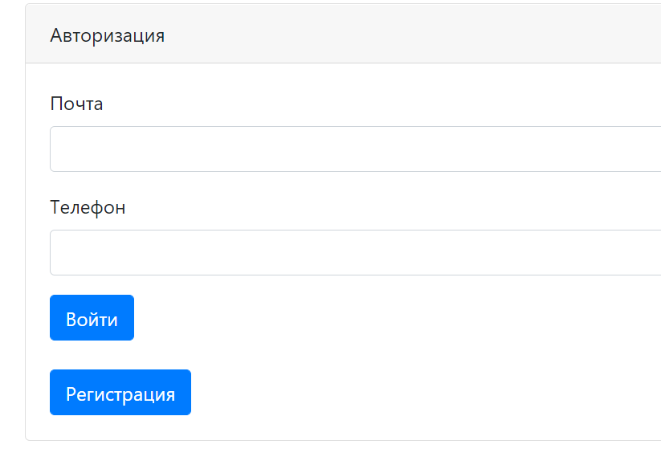
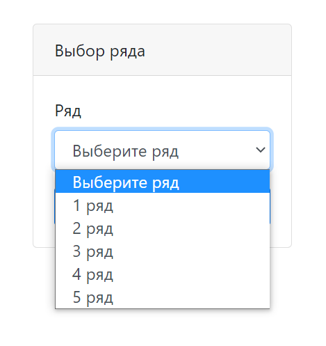
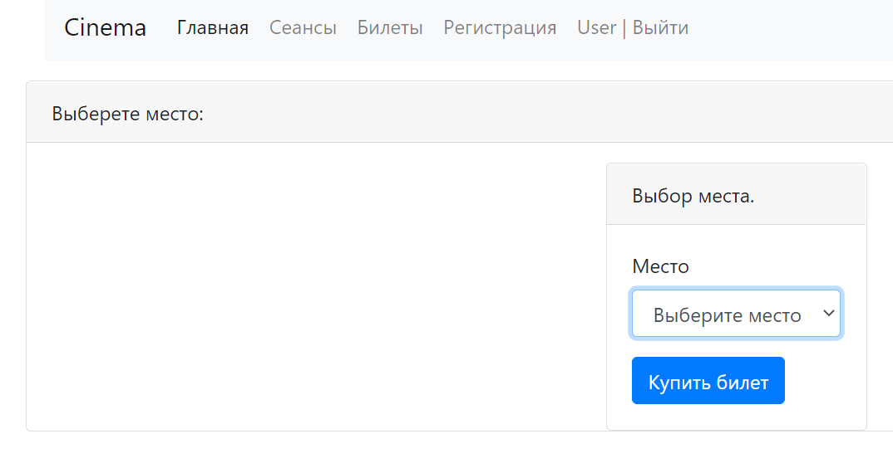
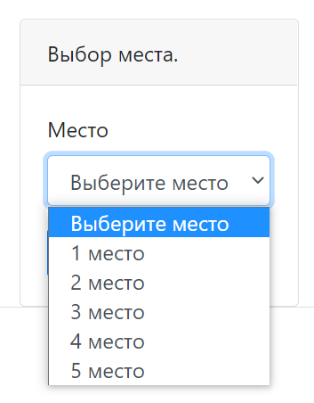
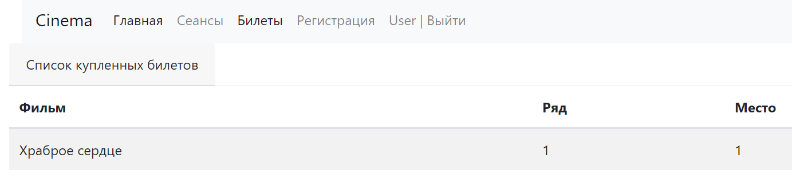

# Cinema

В этом проекте разработан сайт для покупки билетов в кинотеатр.
> **Используемы технологии**: Spring boot, Thymeleaf, Bootstrap, Hibernate, PostgreSql

***
**Требуемые элементы:**
* PostgreSql 14
* JDK 17
* Maven 3.8.1
***
**Перед запуском проекта:**
* создать базу данных с именем ***cinema***
* поменять login/password в файле src/main/resources/db.properties

***
**Запуск приложения:**
* выполнить команду *maven install*
* выполнить команду *java -jar target/job4j_cinema-1.0.jar*
* после запуска сервера перейти на адрес: *http://localhost:8080/index*
***

С главной страницы пользователь может перейти в раздел со списком фильмов

Для перехода в раздел с выбором места требуется произвести регистрацию

Либо выполнить авторизацию

Теперь можно перети к выбору мест

Сначала ряда

Затем места

Далее пользователь попадает на страницу с купленными билетами

При следующей покупке билеты (верно и для другого пользователя)
выбор купленного места будет не доступен